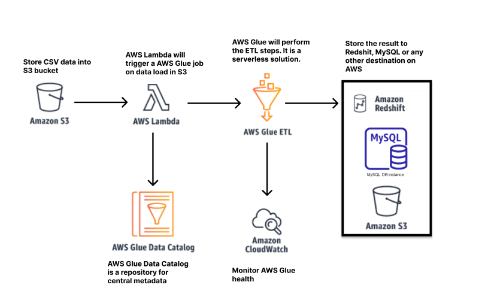

## ETL Assignment

Make sure you have docker and docker compose installed.

Then run,

```sh
docker-compose up
```

Login into airflow: http://localhost:8080/admin with credentials

**username**: airflow
**password**: airflow

Then set the connections as shown in the image.


## Output

#### 1) Grid View of Dags


#### 2) Graph View of Dags


#### 3) Output Result in database


#### 4) Xcom variables during execution


____

# Data lake vs Data Warehouse

A data lake is essentially a highly scalable storage repository that holds large volumes of data in raw format until it is required for use. It can include a mix of structured, semi-structured , and unstructured data formats. Data is stored with a flat architecture and can be queried as needed. For companies that need to collect and store a lot of data but do not necessarily need to process and analyze all of it right away, a data lake offers an effective solution that can load and store large amounts of data very rapidly without transformation.

Data warehouse process and transform data for advanced querying and analytics in a more structured database environment. 

Data lakes requires much larger storage requirement than data warehouses. The raw nature of data lakes usually requires a data scientist to understand and translate into a specific business usecase.


Data warehouses makes processing of data easier to be used in charts, spreadsheets, tables etc. It only requires user to be familiar with the topic about the data.


## Which one is better for your client?
It really depends on the required flexibility vs security.
For e.g. in healtcare systems data lakes would be preferred because of unstructured nature of physicians notes, clinical data etc.

In finance sector a data warehouse would be a better model because it needs to be accessed by the entire company not just data scientist. Also querying important financial data would be much easier and faster through data warehouse.

# Serverless architecture
In Serverless architecture vendor provides backend services when needed. We don't need  to pay for server during its idle time. Serverless architecture offer great scalibility and flexibility at a much cheaper cost. 

Pros:
- Scalable, flexible. Applications built with a serverless infrastructure will scale automatically as the user base grows.
- Quick deployments/ fixes, no need to upload code anywhere
- No need to pay for idle time

Cons:
- Serverless cost also depends on the number of API hits, if the api hits are too large, it can be more expensive than a server centered architecture
- Setting up a serverless architecture with one vendor can make it difficult to switch vendors if needed
- Challenging testing and debugging

# AWS solution



### Working:
1. New csv files would be frequently stored in the Amazon S3 bucket
2. As new file is added into the S3 bucket, it will trigger a lambda event
3. AWS lambda will trigger the AWS Glue ETL which will perform the necessary ETL steps
4. AWS Glue will store the result to AWS Redshift or AWS MySQL DB instance
5. Amazon CloudWatch will monitor and log AWS Glue, since it is a serverless solution  

# What is MLOps

Over the past few years many organizations are embracing AI and machine learning to improve decision making and solve complex problems. Deploying a model in real scenarios isn't easy, it depends on how long does it take for model inference?, some models which work now might not work after two years because of change in data, do we have tools to monitor data? Can we scale the model for multiple users? etc. MLOps is a framework which answers these problems and allows us to perform machine learning more efficiently. It includes many features of DevOps such as automation and testing but is focused on Machine Learning and Data Science by improving deployment and model monitoring. It allows organizations to quickly scale data science practices across the entire organization, without sacrificing safety or quality.

Here is a [reddit post](https://www.reddit.com/r/MachineLearning/comments/mgzvt2/d_whats_the_simplest_most_lightweight_but/) on some popular open source toolkits for MLOps

[Amazon SageMaker](https://aws.amazon.com/sagemaker) also provides purpose-built tools for MLOps to help you automate and standardize processes across the ML lifecycle. Using SageMaker you can easily train, test, troubleshoot, deploy, and govern ML models at scale while maintaining model performance in production.

## MLOps project lifecycle


## Benefits of MLOps:

1. Reduce time on data collection and data preparation
2. Automate Model Building, create reproducible models
3. Accelerate the validation process
4. Monitor and retrain
5. Machine learning resource management system and control
6. Experiment with real data
7. Easy deployment of models

## Cons of MLOps: 
-  Introducing MLOps to your firm might be expensive if you think short-term.

